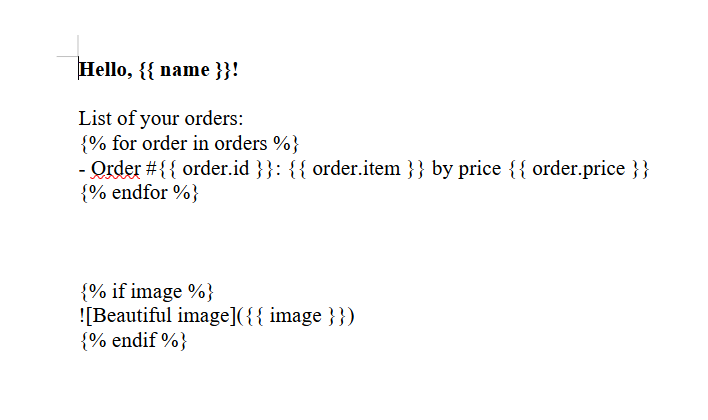
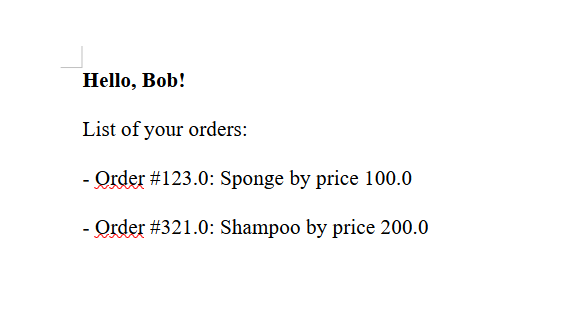

# Document generation service

A microservice for generating documents using templates and transmitted context. It is easy to use, similar to Jinja2
and Django templates.

## Features

- Generate documents from templates using `docxtpl`
- gRPC support for efficient communication
- Supports text, filters, conditions, and loops within templates

## Installation and Setup

### Prerequisites

1. Clone the repository:

```bash
git clone git@github.com:humangrass/docx-py.git
```

2. Ensure you have [python 3.10+](https://www.python.org/downloads/) installed. On UNIX systems, Python may already be
   installed, but make sure to have pip set up. If not, install it via the following command:

```bash
sudo apt-get install python3-pip
```

3. Install project dependencies. It's recommended to use
   a [virtual environment](https://docs.python.org/3/library/venv.html) for isolation:

```bash
python -m venv venv
source venv/bin/activate   # On Windows use: venv\Scripts\activate
pip install -r requirements.txt
```

4. Set up a PostgreSQL database. For ease of setup, you can use [Docker](https://docs.docker.com/engine/install/) and
   the example [docker-compose.yml](docker-compose.example.yml) provided in the repository:

```bash
docker compose -f docker-compose.example.yml up -d
```

To stop the containers:

```bash
docker compose -f docker-compose.example.yml down
```

5. Apply migrations. Make sure the database schema is up-to-date:

```bash
alembic upgrade head
```

### Starting the gRPC Server

To start the gRPC server, run:

```bash
python app/main.py
```

The server will start on port 50051 by default.

### Running the Client Example

The client example will:

* Add a template to the database.
* Generate a document using the template and provided context.
* Remove the template after completion.
* Save the generated document as generated_document.docx.

To run the client:

```bash
python example/client.py
```

### Template Example

Below is an example of how your template might look:



### Generated Document Example

Here is an example of the generated document:



## License

This project is licensed under the [MIT License](LICENSE).
